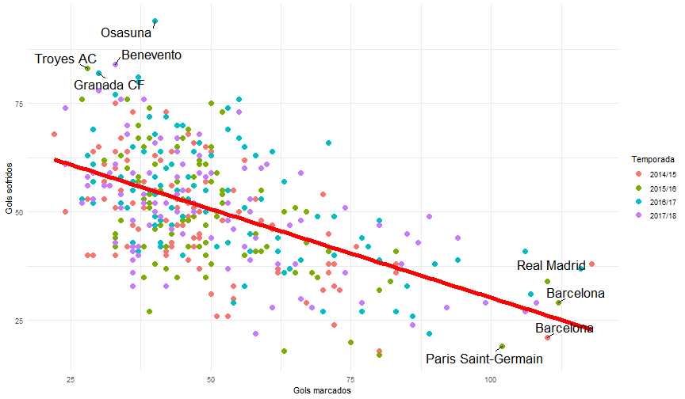

---
title       : Futebol Europeu
subtitle    : Uma análise das maiores ligas nacionais
author      : Ramon Moreira Gonçalves
job         : CE2
framework   : io2012        # {io2012, html5slides, shower, dzslides, ...}
highlighter : highlight.js  # {highlight.js, prettify, highlight}
hitheme     : tomorrow      # 
widgets     : [quiz, bootstrap]            # {mathjax, quiz, bootstrap}
mode        : selfcontained # {standalone, draft}
knit        : slidify::knit2slides
logo        : unb.jpg
biglogo     : logo.jpg
assets      : {assets: ../../assets}

---.segue bg:url(pensando.jpg)

---.segue bg:url(jogador.png)

---.segue bg:darkred

# Competitividade

--- .class

## Pontuação dos clubes em suas respectivas ligas

--- .class

## O ataque é a melhor defesa?

Correlação = -0.5498162

--- &radio2

## Mas o equilíbrio é fundamental!

Os times com o melhor e o pior saldo de gols são, respectivamente :

1. Real Madrid e Osasuna
2. Real Madrid e Troyes AC
3. _Barcelona e Troyes AC_
4. Barcelona e Osasuna

*** =image

*** .explanation

O Barcelona teve um saldo de gols de 89 e o Troyes de -55.

--- .class

## Média de gols

--- .class

## Média de gols

---.segue bg:green

# Multiculturalismo 

--- .class

## Nacionalidade dos jogadores em cada liga

--- .class

## Nacionalidade dos jogadores em cada liga

--- .segue bg:purple

# Apoio dos adeptos

--- .class

## Média de público
### Por liga

--- .class

## Média de público
### Por clube

---.segue bg:grey

# Aptidão dos atletas

--- .class

## Gols

---.class 

## Assistências

---.class

## Goleiros

---.segue bg:url(conclusao.jpg)
